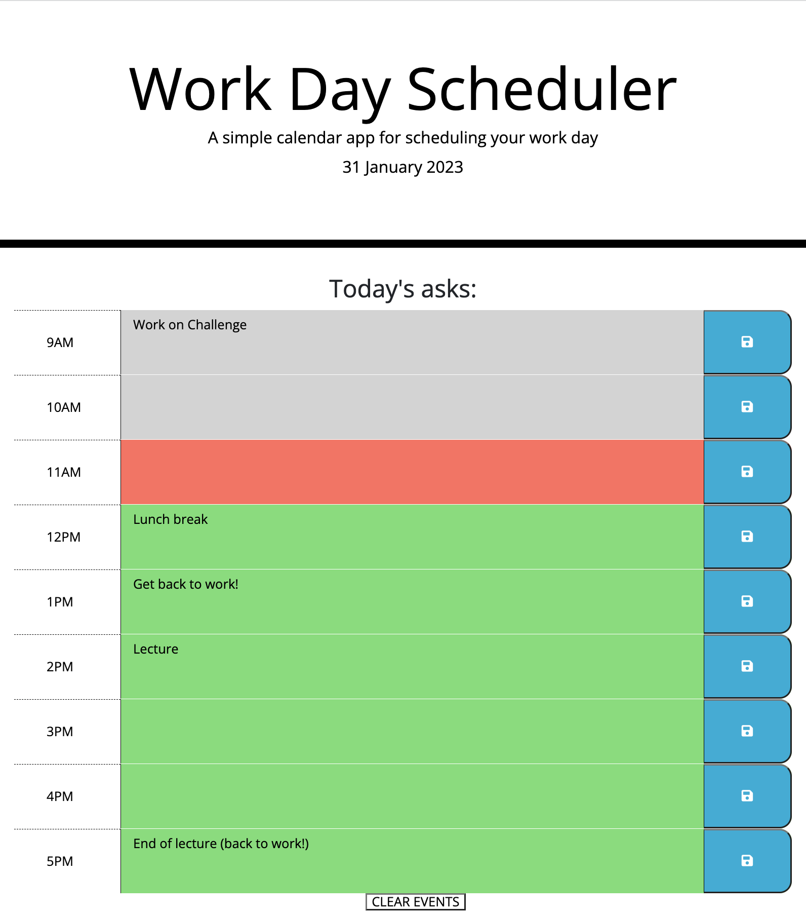
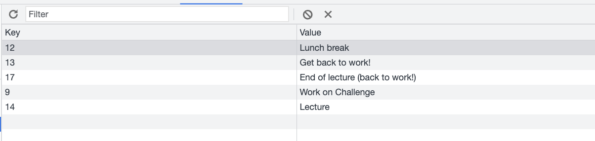
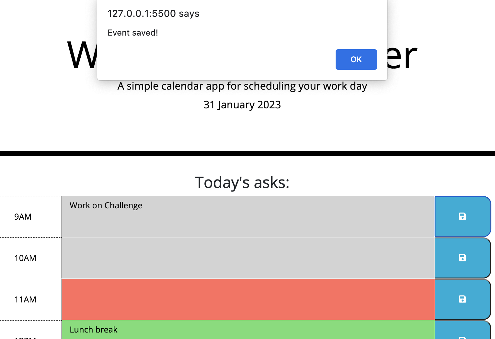
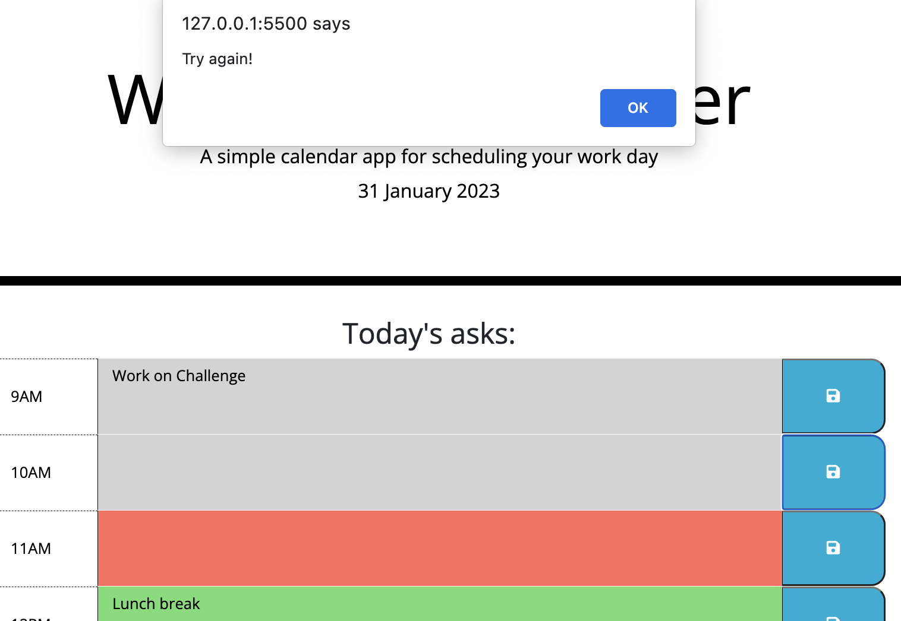
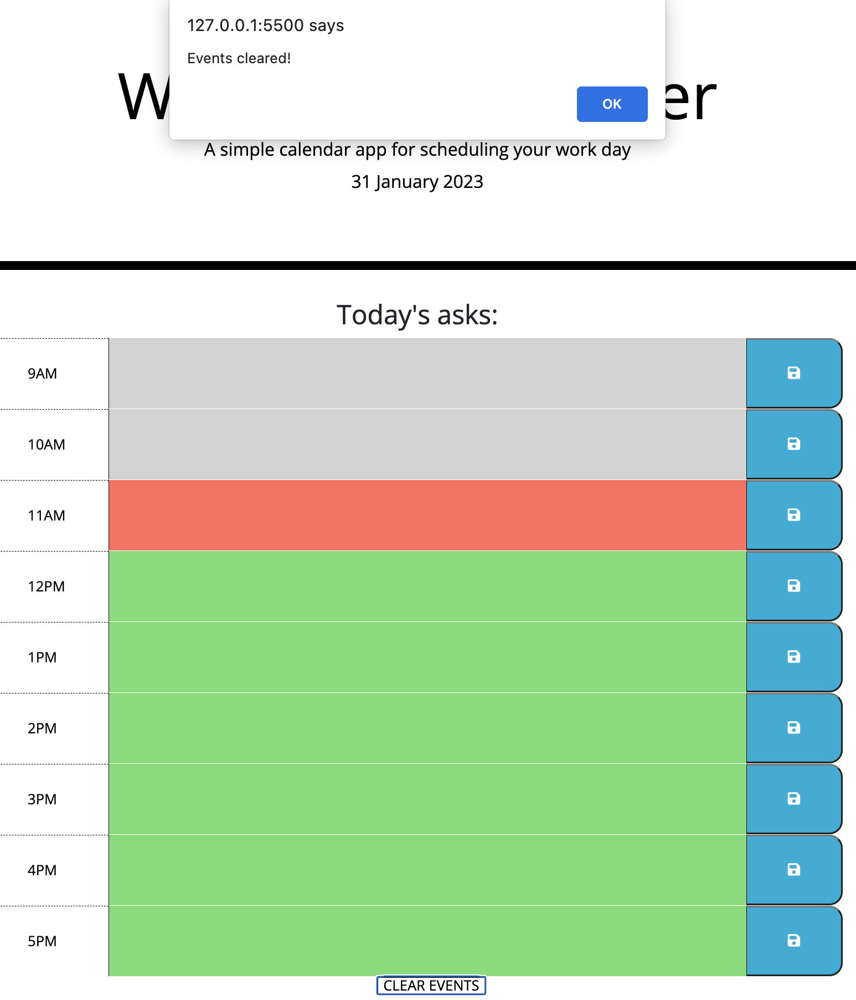

# daily-planner-app

## A daily planner application, made using jQuery

This project is a daily planner. It is a very simple and effective tool, which will continue to display events upon refresh, and features a handy button to clear events at the end of a working day.

Please see below for a number of screenshots, displaying the app's functionality:

## Installation

N/A

## Usage

Wesbite link:

You can test the planner by performing the following tasks:

- To use the planner, simply input any events needed that day. An alert will pop up to indicate your events are saved to local storage, and will be displayed on the planner.
- If you enter an empty field, you will be alerted to 'try again!'. this will not save any data.
- To inspect the local storage, simply access the 'inspect' tool (by pressing command+Option+I (macOS) or Control+Shift+I (Windows)), and click on 'application'. There you will find your stored events for the day.
- You can try refreshing the page. They are still there!
- To clear events, simply click the 'CLEAR EVENTS' button (available at the bottom of the planner). Once clicked, an alert will pop up, and storage and the user fields will be emptied.

## Credits

w3:

- https://www.w3schools.com/jsref/jsref_split.asp
- https://www.w3schools.com/cssref/css3_pr_align-items.php
- https://www.w3schools.com/jsref/met_node_appendchild.asp

Developer.Mozilla:

- https://developer.mozilla.org/en-US/docs/Web/JavaScript/Reference/Global_Objects/parseInt

Font Awesome:

- https://fontawesome.com/v5/icons/save?s=solid&f=classic

Bootstrap:

- https://getbootstrap.com/docs/4.1/layout/grid/
- https://getbootstrap.com/docs/5.2/layout/grid/

Stack Overflow:

- https://stackoverflow.com/questions/10710674/how-to-remove-and-clear-all-localstorage-data

Meetanshi:

- https://meetanshi.com/blog/reload-current-page-without-losing-any-form-data-in-javascript/

## License

Please refer to the licence in the repo.
